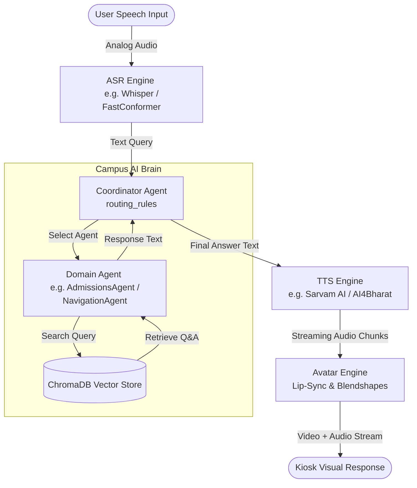

# Text-to-Speech (TTS) Model Evaluation for Hindi & Kannada

This document provides a comparative research analysis of Text-to-Speech (TTS) models evaluated for the Campus AI Brain kiosk project, focusing on Hindi and Kannada language support.

---

## 1. Model Comparison

| Evaluation Metric | AI4Bharat Indic-TTS | Indic Parler-TTS | Coqui XTTS-v2 | Sarvam AI TTS (Bulbul) |
| :--- | :--- | :--- | :--- | :--- |
| **Language Support** | 13+ Indic languages (including Hindi and Kannada) | Hindi and English (Kannada support is experimental) | 17+ global languages (Hindi supported; Kannada unsupported) | 10+ Indic languages (including Hindi and Kannada) |
| **Hindi Quality** | Moderate (Standard unit-selection/robotic output) | High (Natural pronunciation, controllable tone) | Excellent (Rich, emotional, highly expressive) | Outstanding (State-of-the-art natural cadence) |
| **Kannada Quality** | High (Clear, standard dialect pronunciations) | Moderate (Depends on custom community builds) | Poor / Unsupported natively | High (Extremely fluent regional accent) |
| **Real-time Suitability** | Excellent (Sub-100ms latency, runs easily on CPU) | Good (Supports streaming, requires GPU) | Moderate (Requires optimizations like TensorRT-LLM) | Excellent (Sub-150ms latency via streaming API) |
| **Open-Source Status** | Yes (MIT / Academic) | Yes (Apache 2.0) | Yes (Coqui Public Model License - restrictions apply) | No (Proprietary cloud API) |
| **Voice Cloning** | No (Requires extensive custom training) | Style prompt based (e.g. "whispering voice") | Yes (Zero-shot voice cloning from 3s sample) | Yes (Enterprise managed voice-cloning service) |
| **Hardware Requirements**| Low (Standard CPU) | Moderate (Consumer-grade GPU, e.g., RTX 4060) | High (Enterprise GPU, e.g., NVIDIA A10G/RTX 3090) | None (Offloaded to cloud API endpoints) |

---

## 2. Recommendations

### Best Model for Research Prototype
> [!TIP]
> **AI4Bharat Indic-TTS** is recommended for local research prototypes. 
> 
> * **Rationale**: It is open-source, runs efficiently on standard CPU architectures without needing a dedicated GPU, and has native, reliable support for both Hindi and Kannada out-of-the-box. This allows team members to run the complete pipeline offline on standard development laptops.

### Best Model for Production Deployment
> [!IMPORTANT]
> **Sarvam AI TTS** is recommended for production environments.
> 
> * **Rationale**: It provides the highest quality, most natural sounding audio output for Indian languages, particularly Hindi and Kannada. It is delivered as a managed service with high availability, low-latency streaming endpoints, and eliminates the operational overhead of hosting large neural speech models.

### Best Model for Avatar Integration
> [!NOTE]
> **Sarvam AI TTS** (or **Coqui XTTS-v2** for offline hosting) is recommended for Avatar integration.
> 
> * **Rationale**: Digital avatar systems require highly consistent audio streaming to drive real-time lip-sync coordinates (blendshapes). Sarvam AI’s sub-200ms API response time with streaming audio chunks ensures smooth lip synchronization. If strict data privacy/offline hosting is required, **Coqui XTTS-v2** (fine-tuned for Kannada) is the fallback option.

---

## 3. System Query & Output Flow Architecture

The following diagram illustrates how user speech is processed by the automatic speech recognition (ASR) system, routed through the **Campus AI Brain**, translated into synthesized speech via the TTS engine, and rendered by the interactive avatar.

