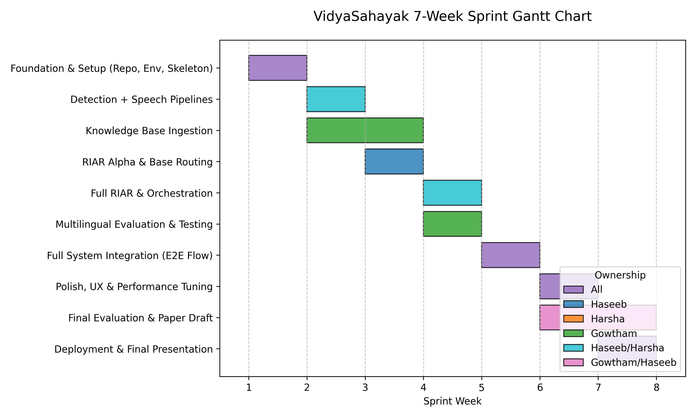

# VidyaSahayak - Requirements & Project Specification

## 1. Project Overview
VidyaSahayak is an AI-powered, multilingual kiosk system deployed at PES University. It assists students, faculty, administrative staff, and visitors through natural voice interactions — combining computer vision, speech processing, multi-agent AI, and retrieval-augmented generation.

The core research contribution is the **RIAR Framework** (Retrieval-Informed Ambiguity Resolution), which detects and resolves query ambiguity before routing to domain-specific knowledge agents.

## 2. Requirement Specifications

### 2.1 Functional Requirements
- **Multilingual Support**: The system MUST understand and respond in English, Kannada, and Hindi.
- **Voice Interaction**: The system MUST accept spoken input (ASR) and provide spoken output (TTS).
- **Person Detection**: The system MUST use a camera feed to detect when a person approaches to automatically trigger a session, and detect when they leave to close the session.
- **Ambiguity Resolution (RIAR)**: The system MUST detect if a user's query is ambiguous across domains and proactively ask a clarification question.
- **Multi-Agent Routing**: The system MUST intelligently route queries to the correct domain agent (Admissions, Academics, Placements, Research, Student Services, Navigation).
- **Orb UI**: The system MUST feature an interactive, glowing orb interface that dynamically changes states (Idle, Greeting, Listening, Processing, Speaking).

### 2.2 Non-Functional Requirements
- **Latency**: End-to-end voice latency (from speech end to orb responding) SHOULD be under 3 seconds.
- **Graceful Degradation**: If Redis fails, the system MUST fallback to SQLite for session storage. If an LLM fails, the system MUST ask the user to repeat the query.
- **Accuracy**: The retrieval system MUST cite its sources for all academic and administrative queries.

---

## 3. Detailed Work Division

The team consists of three engineers: Haseeb, Harsha, and Gowtham.

### Haseeb (Project Lead / Research Lead)
**Primary Ownership:** RIAR Framework, Multi-Agent Orchestration, Person Detection, Orb UI Interface, Frontend UX.
- **RIAR Pipeline**: Implement the ambiguity detection, classification, and clarification generation logic.
- **Multi-Agent Orchestration**: Implement the Coordinator Agent, routing logic, cross-domain dispatch, and response merging.
- **Person Detection**: Train and deploy the YOLO11 person detection pipeline to trigger kiosk sessions via computer vision.
- **Orb State Machine**: Build the core state machine for the orb and hook it into CSS/WebGL for pulsing, spinning, and idle animations.
- **Frontend / UX**: Design and build the React-based kiosk UI.

### Harsha (Engineering Lead)
**Primary Ownership:** FastAPI Backend, Speech Pipeline, Database, System Integration.
- **Core API Layer**: Architect and implement the entire FastAPI backend, routing, and WebSocket real-time connections.
- **Speech Models**: Integrate Whisper (ASR) and Text-to-Speech (TTS) models into the pipeline.
- **Session Management**: Build the session caching layer utilizing Redis and SQLite to track conversation history and latency metrics.
- **DevOps & Integration**: Manage Docker containers, GitHub Actions CI pipelines, and strict Ruff linting compliance.

### Gowtham (Knowledge Systems Lead)
**Primary Ownership:** Knowledge Base, Domain Agents, Campus Navigation, Evaluation.
- **Document Ingestion**: Collect all PES University documents and build the ChromaDB vector ingestion pipeline.
- **Domain Agents**: Implement the Multi-Agent framework using LangChain/LlamaIndex, configuring tailored prompts for Admissions, Academics, etc.
- **Multilingual Fallback**: Handle query translation to bridge gaps between Kannada/Hindi inputs and the English knowledge base.
- **Evaluation & Benchmarking**: Create datasets (500+ queries) and run RAGAS evaluation scripts to benchmark retrieval accuracy and hallucination rates.

---

## 4. Project Timeline & Gantt Chart

The project is structured as a 7-week sprint, culminating in a conference paper submission and live kiosk deployment.

*The chart above illustrates the parallel execution path taken by the three engineers across the 7-week development lifecycle.*
